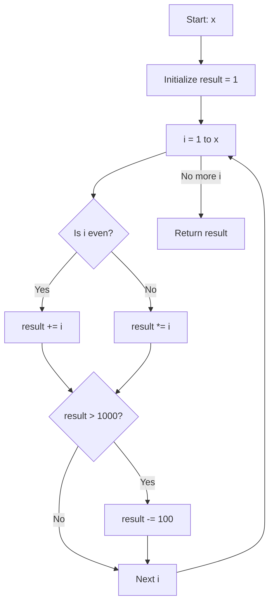

### Function: transform_complex(int x)

```mermaid
graph TD
  A[Start: x] --> B[Initialize result = 1]
  B --> C[i = 1 to x]
  C --> D{Is i even?}
  D -- Yes --> E[result += i]
  D -- No --> F[result *= i]
  E --> G{result > 1000?}
  F --> G
  G -- Yes --> H[result -= 100]
  G -- No --> I[Next i]
  H --> I
  I --> C
  C -->|No more i| Z[Return result]
```
